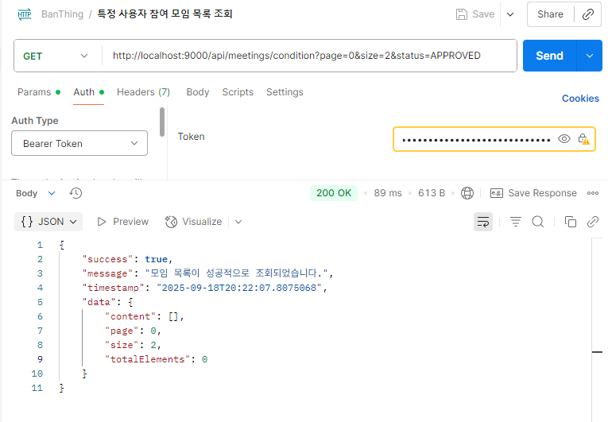
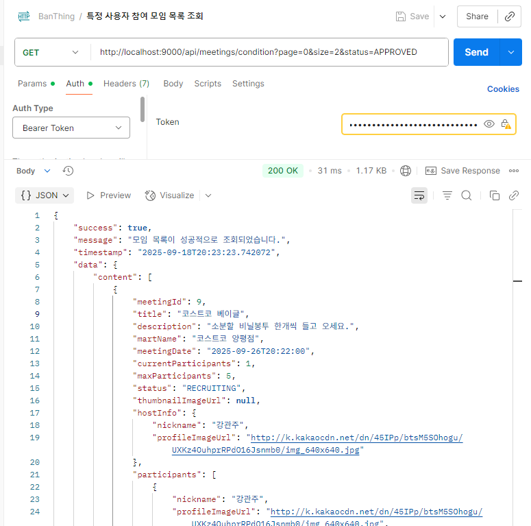

# 🛠️ 트러블슈팅: JPA 네이티브 쿼리에서 Enum 타입 바인딩 문제
- 2025년 9월 18일

---

## 📌 상황

모임(Meeting)에 참여한 사용자의 목록을 **참여 상태(ApplicationStatus)**
별로 조회하는 `getParticipatedMeetings` API를 구현했다.

`status` 파라미터를 `ApplicationStatus` Enum 타입으로 받아 JPA의 
**네이티브 쿼리**를 사용해 데이터를 조회하는 방식이었다.

```java
public MeetingProfilePageResponse getParticipatedMeetings(
    String providerId,
    MeetingParticipant.ApplicationStatus status,
    Pageable pageable) {
    // Enum을 직접 리포지토리로 전달
    Page<Meeting> meetingPage = meetingsRepository.findMeetingsWithMartByUserIdAndStatus(
        user.getUserId(),
        status, // ❌ Enum을 직접 전달
        pageable
    );
}
```

---

## 📌 문제

1. **Enum이 숫자로 변환되어 쿼리 실행**

    * `http://localhost:9000/api/meetings/participated?status=PENDING` 요청 시
    * `PENDING` 문자열을 보냈지만, JPA가 Enum의 순서값(`0`)으로 인식
    * 실제 DB에는 `application_status = 0`이라는 쿼리가 전송됨

2. **타입 불일치로 인한 조회 실패**

    * `MeetingParticipant` 엔티티에서는 `@Enumerated(EnumType.STRING)` 사용
    * DB의 `application_status` 컬럼에는 `'PENDING'`, `'APPROVED'` 등 문자열로 저장
    * `application_status = 0` 조건은 항상 `false`가 되어 **데이터가 조회되지 않음**



---

## 📌 해결

JPA가 네이티브 쿼리 파라미터를 잘못 변환하는 문제를 해결하기 위해, 
Enum 값을 리포지토리로 전달하기 전에 **서비스 레이어에서 명시적으로 문자열로 변환**하도록 수정했다.

### ✅ 수정된 코드

#### FindMeetingService.java

```java
public MeetingProfilePageResponse getParticipatedMeetings(
    String providerId,
    MeetingParticipant.ApplicationStatus status,
    Pageable pageable) {

    log.info("참여 상태 모임 목록 조회 서비스 메서드 - 페이징: {}", pageable);

    User user = usersRepository.findByProviderId(providerId)
        .orElseThrow(() -> new BusinessException(ErrorCode.USER_NOT_FOUND));

    // ✅ status.name()으로 Enum을 문자열로 변환
    Page<Meeting> meetingPage = meetingsRepository.findMeetingsWithMartByUserIdAndStatus(
        user.getUserId(),
        status.name(), // ✅ 명시적 문자열 변환
        pageable
    );
    ...
}
```

#### MeetingsRepository.java

```java
@Query(value = """
    SELECT m.*
    FROM meetings m
    JOIN meeting_participants mp ON m.meeting_id = mp.meeting_id
    JOIN marts ma ON m.mart_id = ma.mart_id
    WHERE mp.user_id = :userId AND mp.application_status = :status_name
        AND m.deleted_at IS NULL
    ORDER BY m.created_at DESC
""",
countQuery = """
    SELECT count(m.meeting_id)
    FROM meetings m
    JOIN meeting_participants mp ON m.meeting_id = mp.meeting_id
    WHERE mp.user_id = :userId AND mp.application_status = :status_name
        AND m.deleted_at IS NULL
""",
nativeQuery = true)
Page<Meeting> findMeetingsWithMartByUserIdAndStatus(
    @Param("userId") Long userId,
    @Param("status_name") String statusName, // ✅ String 타입으로 변경
    Pageable pageable
);
```



---

## 📌 결과

* JPA가 Enum을 자동으로 숫자로 변환하는 문제 해결
* DB에 저장된 문자열 값과 쿼리 조건이 정확히 매칭되어 **데이터 조회 성공**
* 네이티브 쿼리에서 Enum 타입 파라미터를 안전하게 사용 가능

---

## 📌 배운 점

* **JPA 네이티브 쿼리에서는 Enum을 직접 사용하지 말고 명시적으로 문자열 변환해야 한다.**
* `@Enumerated(EnumType.STRING)`을 사용한 엔티티와 네이티브 쿼리 간의 타입 불일치 주의
* 복잡한 타입은 서비스 레이어에서 미리 변환하여 리포지토리에 전달하는 것이 안전하다.
