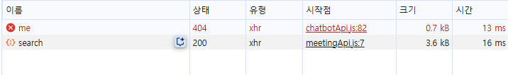
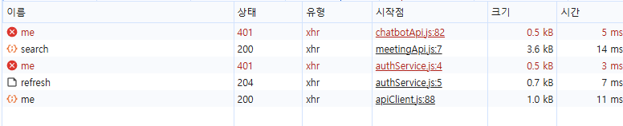

# 🛠️ 트러블슈팅: Spring Security 설정에서 모든 엔드포인트 허용으로 인한 JWT 자동 갱신 실패
- 2025년 9월 19일

---
## 📌 상황

JWT 기반 인증 시스템을 구현하면서 **액세스 토큰 자동 갱신 로직**을 구축했다.
프론트엔드에서는 axios interceptor를 통해 **401 응답 시 자동으로 토큰을 갱신**하도록 설계했고,
백엔드에서는 **Spring Security**로 인증이 필요한 엔드포인트를 보호하도록 구성했다.

```javascript
// 프론트엔드 axios interceptor 로직
apiClient.interceptors.response.use(
  (res) => res,
  async (error) => {
    if (error?.response?.status === 401) {
      // 액세스 토큰 갱신 시도
      await AuthService.refresh();
      return apiClient(originalRequest); // 원래 요청 재시도
    }
    return Promise.reject(error);
  }
);
```

---

## 📌 문제

**1. 예상과 다른 토큰 갱신 동작**

**액세스 토큰 수명을 5분으로 설정**했음에도 불구하고, 5분 후 **로그인이 자동으로 풀리는 현상**이 발생했다.
리프레시 토큰이 유효한 상태에서도 자동 갱신이 동작하지 않았다.

**2. 401 에러 대신 다른 에러 발생**

액세스 토큰 수명을 **매우 짧게 설정하고 테스트**해보니,
만료된 토큰으로 인증이 필요한 요청을 보낼 때 **401 Unauthorized 대신 다른 에러**가 발생했다.

---



---

```javascript
// 기대한 동작: 401 에러 → 토큰 갱신 시도
// 실제 동작: 401이 아닌 다른 에러 → 갱신 로직 미동작
```

---

## 📌 원인 분석

### Spring Security 설정 파일 검토

`SecurityConfig.java`의 `PUBLIC_ENDPOINTS` 배열을 확인한 결과, 
**개발 편의성을 위해 임시로 설정해둔 `"/**"`** 패턴이 문제의 원인이었다.

```java
private static final String[] PUBLIC_ENDPOINTS = {
    "/**", // ❌ 모든 엔드포인트를 public으로 허용
    "/",
    "/health",
    "/h2-console/**",
    "/api/auth/**",
    // ... 기타 public 엔드포인트들
};

.authorizeHttpRequests(authz -> authz
    .requestMatchers(PUBLIC_ENDPOINTS).permitAll() // 모든 요청이 허용됨
    .anyRequest().authenticated() // 이 조건에 도달하지 못함
)
```

### 문제 발생 메커니즘

1. **인증이 필요한 API 호출** (예: `/api/meetings/participated`)
2. **Spring Security에서 `"/**"` 패턴 매칭** → 모든 요청을 `permitAll()`로 처리
3. **인증 검사 생략** → JWT 토큰 만료 여부와 관계없이 요청 허용
4. **401 에러 미발생** → axios interceptor의 토큰 갱신 로직 미동작
5. **다른 비즈니스 로직 에러 발생** (인증되지 않은 상태에서 사용자 정보 조회 시도 등)

---

## 📌 해결

### 1단계: PUBLIC_ENDPOINTS에서 `"/**"` 제거

개발 단계에서 임시로 설정했던 전체 허용 패턴을 제거했다.

```java
private static final String[] PUBLIC_ENDPOINTS = {
    // "/**", // ❌ 제거
    "/",
    "/health", 
    "/h2-console/**",
    "/api/auth/**",
    "/oauth2/**",
    "/login/oauth2/**",
    "/api/meetings/search", // 실제 public 엔드포인트만 명시적으로 허용
    "/api/chatbot/**",
    "/media/**",
    "/images/**"
};
```

### 2단계: 인증 동작 검증

수정 후 **액세스 토큰이 만료된 상태에서 인증이 필요한 요청**을 테스트했다.

```javascript
// 수정 전: 다양한 에러 (403, 500 등)
// 수정 후: 정확한 401 Unauthorized 응답
```

### 3단계: 자동 토큰 갱신 로직 정상 동작 확인

401 응답이 정상적으로 반환되면서 **axios interceptor의 토큰 갱신 로직**이 의도한 대로 동작했다.

---

---

```javascript
// 정상 동작 플로우:
// 1. 만료된 액세스 토큰으로 API 요청
// 2. Spring Security에서 401 응답
// 3. axios interceptor에서 401 감지
// 4. AuthService.refresh()로 토큰 갱신
// 5. 원래 요청 재시도 → 성공
```

---

## 📌 결과

**토큰 갱신 로직 정상화:**
- 액세스 토큰 만료 시 **자동으로 리프레시 토큰을 통해 갱신**
- **5분마다 로그인이 풀리는 문제 해결**
- 사용자가 **중단 없이 서비스 이용 가능**

**보안 정책 명확화:**
- **실제 public 엔드포인트만 명시적으로 허용**
- 인증이 필요한 리소스에 대한 **적절한 접근 제어 복원**
- **개발 편의성과 보안 사이의 균형** 확보

---

## 📌 배운 점

**Security 설정의 중요성:**
- **아무리 완벽한 인증 로직을 구현해도 Security 설정이 잘못되면 무의미**하다.
- `"/**"` 같은 **와일드카드 패턴 사용 시 의도치 않은 부작용** 발생 가능성을 항상 고려해야 한다.

**개발 단계 임시 설정 관리:**
- **개발 편의를 위한 임시 설정은 명확한 주석과 함께 관리**해야 한다.
- **기능 개발 완료 후 Security 설정을 다시 검토**하는 과정이 필수적이다.

**디버깅 시 레이어별 검증:**
- **프론트엔드 로직만 확인하지 말고 백엔드 설정도 함께 검토**해야 한다.
- **HTTP 상태 코드가 예상과 다를 때는 Security 설정부터 확인**하는 것이 효과적이다.

**인증 시스템 설계 원칙:**
- **명시적 허용(Explicit Allow)**이 **암묵적 허용(Implicit Allow)**보다 안전하다.
- **최소 권한 원칙(Principle of Least Privilege)**을 항상 염두에 두고 설정해야 한다.
